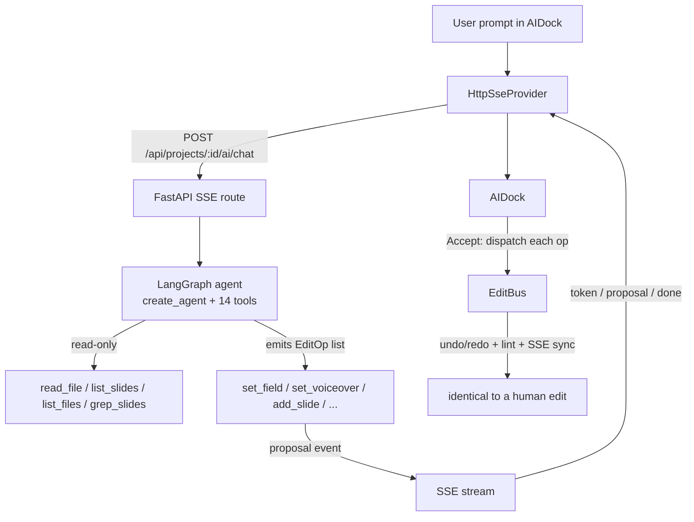

# AI Integration

The `AIDock` is a conversational co-pilot. A LangGraph agent runs on the Python
backend, explores the project with read-only tools, and proposes edits as `EditOp`
lists. The user accepts or rejects each proposal; on Accept the frontend dispatches
every op through the same `EditBus` a human edit uses.

Full implementation contract: [`docs/ai.md`](../ai.md). Product north-star:
[RFC 0002](../rfc/0002-ai-subsystem.md).

## Architecture



## Key design principle: AI flow == human flow

The agent **never writes the document**. Every mutation it wants becomes an
`EditOp` — the exact same JSON shape as the frontend `EditBus` union
(`ovk-web/src/shared/edit/EditBus.ts`). The `AIDock`'s `handleAccept` loops over
`proposal.edit.ops` and dispatches each via `editBus.dispatch(op, "ai:langgraph")`.

Because undo/redo (`inverseOp`, captured at dispatch time), the `lintHtml` gate,
and the SSE sync round-trip all key off `EditBus` events, **an AI edit travels the
identical path as a human edit**. There is no separate AI mutation track, no
backdoor write, and no duplicated undo logic.

## The proposal contract

The SSE stream carries `AIStreamEvent`s (`ovk-web/src/shared/ai/types.ts`):

- `{type:"token", text}` — streamed LLM tokens.
- `{type:"tool_start"/"tool_end", ...}` — tool invocation telemetry.
- `{type:"proposal", edit}` — `edit = {id, ops: EditOp[], rationale, slideId?}`.
- `{type:"done"}` / `{type:"error", message}`.

The old three-tier `EditProposal` (JSON-patch / HTML-swap / addSlide) was retired
alongside the `EchoProvider` mock — it couldn't express root-level ops like
`setCaptionStyle` or `reorderSlides`. The op-list shape covers the full `EditOp`
union.

## Tools

The agent has **read-only** filesystem tools to ground itself (sandboxed to the
project dir) and **semantic OVK tools** that map 1:1 to `EditOp`s. There is no
generic `write_file`/`edit_file` — that would be a backdoor around `EditBus` and
break undo. See [`docs/ai.md` §3](../ai.md) for the full 14-tool catalog.

`set_voiceover` is special: it runs TTS server-side at proposal time so the
proposal carries the *measured* audio duration (a human can't save a voiceover
edit without generating either). It emits both `setVoiceover` and `setDuration`.

## Configuration

The agent reads config from env / `.env` (auto-loaded by `config.py`):

| Variable | Default | Purpose |
|---|---|---|
| `OPENAI_BASE_URL` | `https://api.openai.com/v1` | Any OpenAI-compatible endpoint (OpenRouter, Ollama, vLLM, LM Studio) |
| `OPENAI_API_KEY` | _(empty)_ | Required to use AI |
| `OVK_AI_MODEL` | `gpt-5.4-nano` | Default chat model id |
| `OVK_AI_TIER2_MODEL` | _= OVK_AI_MODEL_ | Reserved for `set_slide_html` coding-model routing |
| `OVK_AI_TEMPERATURE` | `0.3` | Sampling temperature |
| `OVK_AI_MAX_STEPS` | `8` | Cap on agent tool-calling steps per turn |
| `OVK_AI_REASONING_EFFORT` | _(empty)_ | `low`/`medium`/`high` — reasoning models only (gpt-5, o1, o3, gpt-oss). Leave empty for non-reasoning models |

Smoke-test the connection before using the dock:

```bash
uv run ovk llm test
```

## Undoability

All proposals converge on `editBus.dispatch(op, "ai:langgraph")`. Because the bus
captures the pre-edit inverse for every op (see [state.md](./state.md)), AI-accepted
edits are fully undoable via ⌘Z — identical to human edits. There is no separate AI
history track.
