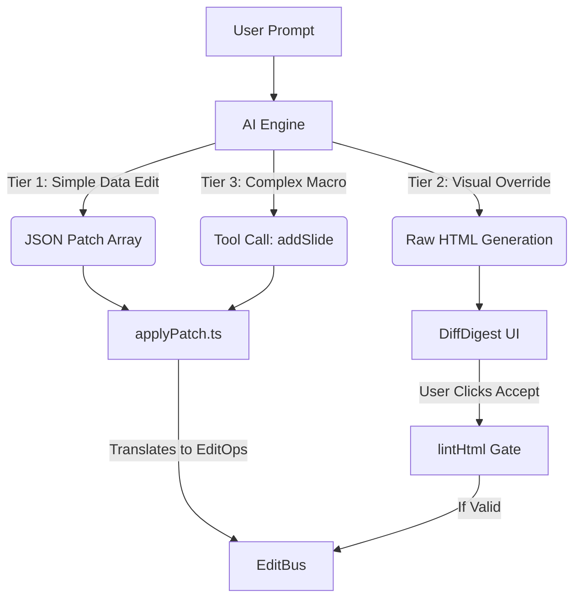

# AI Integration & Multi-Tier Architecture

The `AIDock` is designed as a conversational co-pilot that can perform actions across the entire editor.

## The Problem: AI Generative Costs

**Problem**: Asking an LLM to generate an entire HTML slide just to change a title from "Hello" to "Welcome" is incredibly slow, expensive, and error-prone (the AI might hallucinate invalid HTML).

**Solution**: `RFC 0002` Multi-Tier AI Architecture. We route user intent to the cheapest, safest tier of execution.

## Integration Details

### Tier 1: JSON Patch Edits
Instead of returning a massive JSON payload representing the whole project, the AI returns an array of `RFC 6902` JSON patches.
- Example: `[{ "op": "replace", "path": "/fields/title", "value": "Welcome" }]`
- The `applyPatch.ts` utility intercepts these and translates them directly into `setField` operations on the `EditBus`.
- *Result*: Instant, cheap updates.

### Tier 3: Macro Actions
If the user asks to "Add a new slide", the AI executes a function/tool call.
- The `AIDock` catches the `addSlide` tool call, generates a new slide ID locally, and dispatches it.

### Tier 2: HTML Generation
When the user requests visual changes (e.g., "Make the text much bigger and red"), the AI streams a full HTML string in a markdown code block.
- **DiffDigest**: The chat UI wraps the raw HTML in a `DiffDigest` component. It truncates massive HTML walls behind a "Click to expand" UI so the chat remains readable.
- **Validation**: Before the HTML is committed, it must pass the same `lintHtml` rules as human-written code. If the AI hallucinates `<html>` wrappers instead of `<template>`, it is blocked.

### Undoability
All three tiers converge on the same `EditBus.dispatch(op, 'ai:echo')`. Because the bus captures the pre-edit inverse for every op (see [state.md](./state.md)), AI-accepted edits are fully undoable via ⌘Z / the overflow menu — identical to human edits. There is no separate AI history track.
