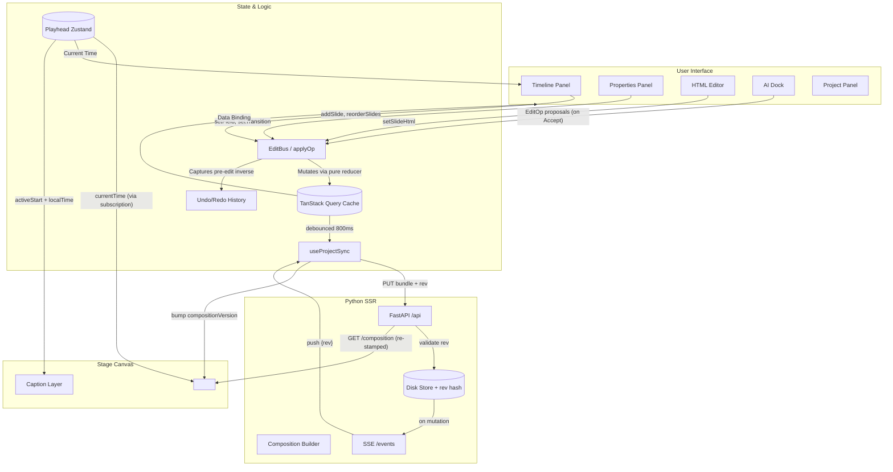

# Web Frontend Architecture

This document describes the high-level architecture of the `ovk-web` frontend
and the Python SSR backend it talks to.

## 1. The Core Problem: Data vs. Animation

**Problem**: Traditional video editors store scenes as deeply nested, proprietary
JSON scene graphs. This makes it easy to build UI controls (like sliders and color
pickers) but severely limits expressiveness. If an AI wants to add a complex GSAP
animation or a unique SVG filter, it can't—unless the JSON schema explicitly
supports it.

**Solution**: Strict two-level separation of concerns.
> **"JSON is data. HTML is animation."**

1. **The Data Layer (`ProjectBundle`)**: Tracks structural metadata—slide
   ordering, durations, field values (text, colors), and asset references. This is
   strictly JSON and easily bound to React forms.
2. **The Animation Layer (`slideHtml`)**: Each slide can possess a raw HTML
   override (a bare `<template>`). This keeps the canvas completely open for the AI
   or power users to write any CSS/GSAP they want without breaking the editor's
   data model.

---

## 2. System topology

Two servers run in dev (launched by `./scripts/dev.sh`):

```
Browser (:3000)                Vite dev (:3000)              Python API (:8000)
  │                               │                               │
  │  SPA (React 19 + TanStack)    │  proxy /api → :8000           │  FastAPI + uvicorn
  │  <hyperframes-player>         │                               │  disk-backed store
  │    └─ iframe ← src=/api/...   │                               │  SHA-256 rev
  │                               │                               │  SSE pub/sub
```

- **Python API** (`src/openvideokit/`) — serves project JSON, stamped HF
  compositions, accepts PUTs with optimistic-locking rev, pushes SSE.
- **Vite dev** (`ovk-web/`) — serves the SPA, proxies `/api` → Python.
- In production, both can be served from the same origin.

---

## 3. Architectural flow

The application is built around a decoupled cycle: the UI dispatches edits, the
EditBus mutates the cache, a debounced sync PUTs to the server, the server
re-stamps the composition, and the HF player reloads.



### The edit → preview loop

```
User types in Properties Panel
  → EditBus.dispatch(setField)           instant (TanStack cache)
  → panels re-render immediately
  → useProjectSync detects cache change
  → 800ms debounce
  → PUT /api/projects/{id} (with rev)    full bundle
  → store.upsert_project() (rev check)
  → 200 OK → compositionVersion++
  → HF player src changes (?v=N)
  → iframe reloads → GET /composition (re-stamped)
  → preview reflects the edit
```

### External mutation (AI agent, another client)

The LangGraph AI agent (`src/openvideokit/ai/`, see [docs/ai.md](../ai.md)) does
**not** mutate the store directly. It streams `EditOp` proposals over SSE; the
user Accepts them in the `AIDock`, which dispatches through the same `EditBus` a
human edit uses (AI flow == human flow). A *different* client (or a second tab)
mutating the store is the classic external-mutation path:

```
Another client PUTs (or AI dispatches an accepted op) → local PUT
  → events.broadcast(projectId, rev)
  → SSE push to all connected clients
  → useProjectSync invalidates query
  → refetch GET /api/projects/{id} (fresh bundle + new rev)
  → compositionVersion++ → HF player reloads
```

---

## 4. Key Components & Responsibilities

1. **Python SSR server** (`src/openvideokit/`): Serves project JSON, stamps
   self-contained HF compositions (all slides inlined, single GSAP root timeline),
   accepts PUTs with content-hash optimistic locking, pushes SSE on mutation. See
   [`concurrency.md`](./concurrency.md) for the rev/SSE design.
2. **TanStack Query**: The client-side source of truth for the active project.
   `useProject` fetches; `useProjectSync` handles the PUT/SSE round-trip.
3. **`<hyperframes-player>`**: The real HyperFrames web component. Loads the
   self-contained composition via `src=compositionUrl(projectId)?v=N`. The player's
   probe resolves `window.__timelines['root']` → direct-timeline adapter → drives
   GSAP via same-origin `timeline.seek()` (no HF runtime injection, no postMessage).
   The playhead store pushes `currentTime` via a raw Zustand subscription (zero
   React re-renders per frame).
4. **EditBus**: A custom synchronous event dispatcher (`EditBusProvider`, mounted
   at the **root** in `__root.tsx`). It intercepts UI actions, updates the TanStack
   Query cache locally, and captures each op's inverse from the *pre-edit* state
   onto the history stack. Both `applyOp` and `inverseOp` are
   exhaustiveness-checked.
5. **useProjectSync**: Mounted in `Studio.tsx`. Two channels:
   - **SSE listener** (`EventSource` on `/events`) — server pushes when anything
     mutates the store → refetch + reload preview.
   - **Debounced autosave** — 800ms after a local edit → `PUT` with `rev`. On 409
     (stale rev): reload server's bundle + toast.
6. **compositionVersion** (Zustand): Bumped after every successful PUT or SSE push.
   StageCanvas appends `?v=N` to the HF player `src` so the iframe reloads with the
   re-stamped composition.
7. **Panel registry**: Every editor surface is a first-class panel registered in
   `src/features/studio/panels.ts`. See
   [editor-components.md §5](./editor-components.md).

---

## 5. Why self-contained compositions

The root composition inlines ALL slides directly (no `data-composition-src`
sub-loading). This lets the HF player use its **direct-timeline adapter** path —
it reads `window.__timelines` and drives the GSAP timeline without injecting the
HF runtime.

If `data-composition-src` were present, the player would inject
`@hyperframes/core` runtime (CDN), which would try async sub-comp loading — more
complex and adds a network dependency. The self-contained approach is simpler and
works fully offline.

See [`ssr.md`](./ssr.md) for the stamping mechanism and
[`templates.md`](./templates.md) for the `__OVK_*__` token convention.
