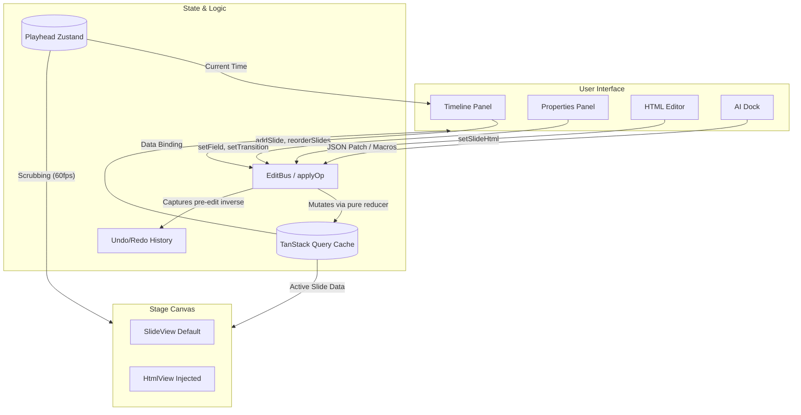

# Web Frontend Architecture

This document describes the high-level architecture of the `ovk-web` frontend, exploring the fundamental problems it solves, the chosen solutions, and the data flow.

## 1. The Core Problem: Data vs. Animation

**Problem**: Traditional video editors store scenes as deeply nested, proprietary JSON scene graphs. This makes it easy to build UI controls (like sliders and color pickers) but severely limits expressiveness. If an AI wants to add a complex GSAP animation or a unique SVG filter, it can't—unless the JSON schema explicitly supports it.

**Solution**: Strict two-level separation of concerns. 
> **"JSON is data. HTML is animation."**

1. **The Data Layer (`ProjectBundle`)**: Tracks structural metadata—slide ordering, durations, field values (text, colors), and asset references. This is strictly JSON and easily bound to React forms.
2. **The Animation Layer (`slideHtml`)**: Each slide can possess a raw HTML override (a bare `<template>`). This keeps the canvas completely open for the AI or power users to write any CSS/GSAP they want without breaking the editor's data model.

---

## 2. Architectural Flow

The application is built around a decoupled cycle: the UI dispatches events, the EditBus mutates the cache, and the Canvas reacts.

---

## 3. Key Components & Responsibilities

1. **API Mocking (MSW)**: Currently, `ovk-web` operates completely standalone via a Mock Service Worker (`src/shared/api/msw/handlers.ts`). MSW intercepts `GET /api/projects/:id` and returns a fixture `ProjectBundle`.
2. **TanStack Query**: Acts as the single source of truth for the active project.
3. **StageCanvas**: The preview engine. It is strictly a read-only consumer of the active slide. It does not possess complex editing logic; its only job is rendering the `SlideView` (fallback) or the `HtmlView` (HTML override) at 60fps.
4. **EditBus**: A custom synchronous event dispatcher (`EditBusProvider`, mounted at the **root** in `__root.tsx` so the entire app — header included — shares one bus). It intercepts UI actions, updates the TanStack Query cache locally, and captures each op's inverse from the *pre-edit* state onto the history stack. Both `applyOp` and `inverseOp` are exhaustiveness-checked, so a new op kind without an apply/inverse case is a compile error.
