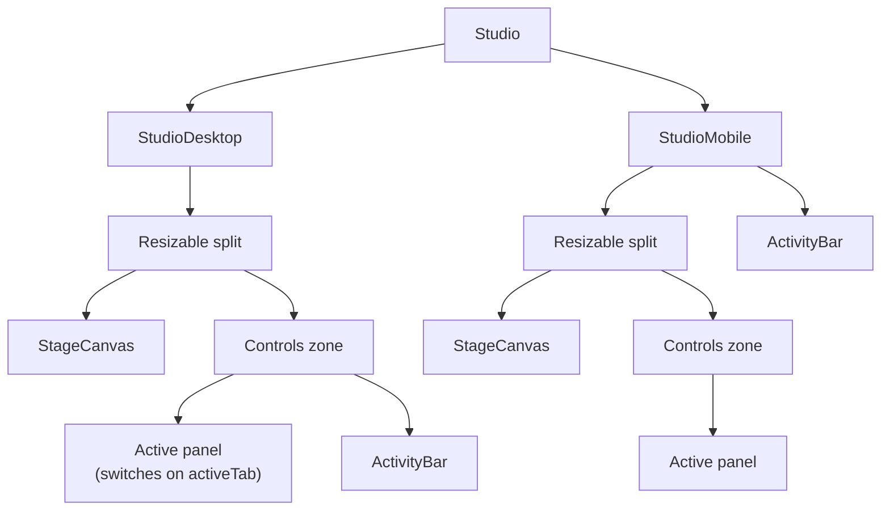

# Editor Components

This document outlines the major UI components in the editor, the UX challenges they solve, and their place in the layout hierarchy.

## Layout Hierarchy

Both layouts share one panel registry and one activity bar — only the topology (horizontal vs. vertical split) differs. The active panel is whatever `activeTab`/`active` points to; the activity bar selects it.

## 1. TimelinePanel (`src/features/timeline/TimelinePanel.tsx`)

The horizontal scrubbable timeline.

**Problem (Layout Shift)**: Originally, slide action buttons (`Duplicate`, `Delete`) appeared on hover inside the slide clips themselves. This caused the flex container to expand, brutally truncating the slide title and causing a jarring layout shift every time the user hovered or tapped on mobile.

**Solution (Dedicated Toolbar)**: The actions were moved out of the slide clips into a dedicated "Slide Action Toolbar" locked above the timeline. It tracks the `activeSlideId` based on the playhead, displaying operations cleanly without disrupting the drag-and-drop hitboxes.

## 2. HtmlEditor (`src/features/html-editor/HtmlEditor.tsx`)

The raw `<template>` authoring environment.

**Problem (The Empty Editor Panic)**: If a user clicked the "HTML" tab for a new slide that hadn't been overridden yet, the editor showed a completely blank screen. If they typed valid HTML but forgot a `<template>` tag, the `lintHtml` gate would scream at them.

**Solution (Boilerplate Prefill)**: 
- The editor injects a `DEFAULT_SHELL` containing a fully compliant `<template>`, CSS block, and `__FIELD__` variables whenever it detects an empty override.
- This gives the user (and the AI) a solid starting structure.
- **LintGate**: Before any HTML is dispatched to the `EditBus`, it is synchronously evaluated by `lintHtml`. If it contains Tailwind (R4) or lacks a template (R1), the "Accept" button is hard-disabled.

## 3. StageCanvas (`src/features/stage/StageCanvas.tsx`)

**Problem**: The editor needs to preview slides accurately, but the actual Jinja2 rendering engine lives on the Python backend (which the frontend cannot reach during offline development).

**Solution**:
- **HtmlView**: If a slide possesses an HTML override, the canvas safely injects it via `dangerouslySetInnerHTML`. It manually regex-replaces `__TITLE__` and `__BODY__` with live field data to simulate the backend's Jinja2 stamping.
- **SlideView**: If no HTML override exists, it renders a hardcoded React fallback that mimics the default `eco-bottle` theme layout, ensuring the user always sees *something* on the canvas.

## 4. AppShell Overflow Menu (`src/app/layout/AppShell.tsx`)

The global header's single overflow menu (same on every breakpoint).

**Problem (No undo affordance)**: The undo/redo engine (`useUndoRedo` + `useHistory`) existed and the ⌘Z keyboard listener worked, but there was no visible UI — a user had no way to click undo or see whether anything was undoable.

**Solution (Overflow menu items)**:
- Undo / Redo items live inside the existing overflow menu (above Export), with `Undo2` / `Redo2` icons and `⌘Z` / `⌘⇧Z` shortcut hints.
- They render **only on project routes** (`projectId` from `useParams`); on home/settings they are hidden.
- Each is `disabled` when its stack is empty (`canUndo` / `canRedo` derive from the `useHistory` Zustand store).
- `useUndoRedo` is mounted here (not in `Studio`) so the keyboard listener stays alive app-wide; a ref pattern keeps the listener calling the latest `undo`/`redo`.

## 5. Panel System & Activity Bar (`src/features/studio/panels.ts`, `MobileToolbar.tsx`)

Every editor surface is a **first-class panel** registered in one place.

**Problem (Surface sprawl)**: As the editor grows (props, timeline, html, assets, captions, ai, project, …), hardcoding each tab in the layouts means editing N files per new panel and no consistent selector. An earlier attempt nested `Slide | Project` tabs *inside* `PropertiesPanel`, which mixed slide-scoped and project-scoped concerns.

**Solution (Single registry + selector)**:
- `panels.ts` holds the `PanelId` union and a `PANELS` table (`{ id, label, icon, landsIn }`). Adding a panel = **one row here + one component**. `getPanel(id)` throws at module load if the table is missing an entry.
- `MobileToolbar` (the activity bar) just `map`s over `PANELS` — it has zero knowledge of individual panels.
- `StudioDesktop`/`StudioMobile` switch on `activeTab`/`active` to render the active panel's component. Each panel stays single-responsibility (`PropertiesPanel` is slide-only; `ProjectPanel` is project-only).

**Activity bar scroll behavior**: each button is `shrink-0 min-w-14` — a square 56×56 touch target (width token matches the bar's `h-14`). Buttons never compress, so the nav's `overflow-x-auto` actually engages when panels exceed the width. (The prior `flex-1` fought the scroll container: it squeezed buttons to zero instead of scrolling.) Total bar width before scroll = `panels × 56px + gaps`.

## 6. ProjectPanel (`src/features/project/ProjectPanel.tsx`)

Project-scoped overview, distinct from the slide-scoped `PropertiesPanel`. Takes `project: ProjectBundle` (not a slide).

**Problem (Caption-style double source of truth)**: Caption styling already has a home — the **Captions panel**, which owns the preset picker plus all granular controls via the `useCaptionSettings` Zustand store (colors, glow, weight, pill, …). `root.theme.caption_style` in the bundle is a separate, unsynced field. Putting a caption-style picker in the Project panel duplicated the Captions panel and wrote to the orphaned source.

**Solution (Read-only project metadata)**:
- ProjectPanel shows project-wide **read-only** facts: canvas (resolution/fps), slide count, default transition, fonts, theme colors.
- No editable fields today — the only root-level `EditOp` (`setCaptionStyle`) is the one that conflicted, and the other root fields (canvas, fonts, colors, transition, audio) have no ops yet. When real root ops land, this panel is the natural place to surface them.
- Caption styling stays exclusively in the Captions panel.
