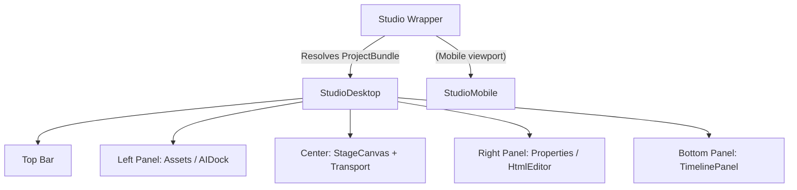

# Editor Components

This document outlines the major UI components in the editor, the UX challenges they solve, and their place in the layout hierarchy.

## Layout Hierarchy

## 1. TimelinePanel (`src/features/timeline/TimelinePanel.tsx`)

The horizontal scrubbable timeline.

**Problem (Layout Shift)**: Originally, slide action buttons (`Duplicate`, `Delete`) appeared on hover inside the slide clips themselves. This caused the flex container to expand, brutally truncating the slide title and causing a jarring layout shift every time the user hovered or tapped on mobile.

**Solution (Dedicated Toolbar)**: The actions were moved out of the slide clips into a dedicated "Slide Action Toolbar" locked above the timeline. It tracks the `activeSlideId` based on the playhead, displaying operations cleanly without disrupting the drag-and-drop hitboxes.

## 2. HtmlEditor (`src/features/html-editor/HtmlEditor.tsx`)

The raw `<template>` authoring environment.

**Problem (The Empty Editor Panic)**: If a user clicked the "HTML" tab for a new slide that hadn't been overridden yet, the editor showed a completely blank screen. If they typed valid HTML but forgot a `<template>` tag, the `lintHtml` gate would scream at them.

**Solution (Boilerplate Prefill)**: 
- The editor injects a `DEFAULT_SHELL` containing a fully compliant `<template>`, CSS block, and `__FIELD__` variables whenever it detects an empty override.
- This gives the user (and the AI) a solid starting structure.
- **LintGate**: Before any HTML is dispatched to the `EditBus`, it is synchronously evaluated by `lintHtml`. If it contains Tailwind (R4) or lacks a template (R1), the "Accept" button is hard-disabled.

## 3. StageCanvas (`src/features/stage/StageCanvas.tsx`)

**Problem**: The editor needs to preview slides accurately, but the actual Jinja2 rendering engine lives on the Python backend (which the frontend cannot reach during offline development).

**Solution**:
- **HtmlView**: If a slide possesses an HTML override, the canvas safely injects it via `dangerouslySetInnerHTML`. It manually regex-replaces `__TITLE__` and `__BODY__` with live field data to simulate the backend's Jinja2 stamping.
- **SlideView**: If no HTML override exists, it renders a hardcoded React fallback that mimics the default `eco-bottle` theme layout, ensuring the user always sees *something* on the canvas.

## 4. AppShell Overflow Menu (`src/app/layout/AppShell.tsx`)

The global header's single overflow menu (same on every breakpoint).

**Problem (No undo affordance)**: The undo/redo engine (`useUndoRedo` + `useHistory`) existed and the ⌘Z keyboard listener worked, but there was no visible UI — a user had no way to click undo or see whether anything was undoable.

**Solution (Overflow menu items)**:
- Undo / Redo items live inside the existing overflow menu (above Export), with `Undo2` / `Redo2` icons and `⌘Z` / `⌘⇧Z` shortcut hints.
- They render **only on project routes** (`projectId` from `useParams`); on home/settings they are hidden.
- Each is `disabled` when its stack is empty (`canUndo` / `canRedo` derive from the `useHistory` Zustand store).
- `useUndoRedo` is mounted here (not in `Studio`) so the keyboard listener stays alive app-wide; a ref pattern keeps the listener calling the latest `undo`/`redo`.
