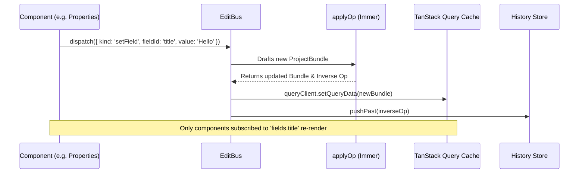
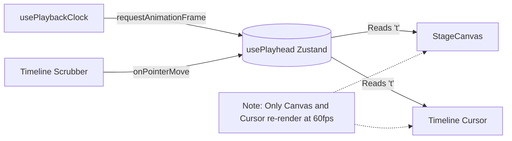

# State Management

The `ovk-web` application avoids massive global React context trees. Instead, it utilizes three distinct, highly optimized state management strategies depending on the domain.

## 1. The EditBus (Project Mutations)

**Problem**: If the entire project tree is stored in a single React `useState` or `useReducer`, any small edit (like typing a letter in a title) causes the entire Timeline, Canvas, and AI Dock to re-render, destroying performance.

**Solution**: The `EditBus` + TanStack Query cache mutation.

- **Operations**: The UI only emits strict commands (`addSlide`, `removeSlide`, `setField`, `setSlideHtml`, `duplicateSlide`).
- **Undo/Redo**: Every operation dispatched through the bus automatically generates its inverse (via `inverseOp.ts`) and pushes it to a localized Zustand history stack.

## 2. The Playhead (60fps Volatile State)

**Problem**: Video scrubbing and playback run at 60fps. If the playhead time (`t`) is stored in TanStack Query or React Context, scrubbing the timeline would cause the entire application UI to re-render 60 times a second.

**Solution**: A dedicated Zustand store (`usePlayhead`).

- `usePlayhead` stores highly volatile data: `t` (current time), `playing` (boolean), and `duration` (total project length).
- Components that don't care about the exact millisecond (like the Properties panel or the HTML Editor) do not subscribe to this store, shielding them from render churn.

## 3. Derived State

**Problem**: Determining which slide is currently visible on the canvas requires calculating the cumulative sum of all previous slide durations. Doing this on every render is expensive and error-prone.

**Solution**: Memoized selector hooks.
- **`useActiveSlide`**: Subscribes to the `usePlayhead` and the `ProjectBundle`, calculates the cumulative starts, and returns the ID and metadata of the currently visible slide.
- If the playhead scrubs within the bounds of a single slide, `useActiveSlide` does not trigger a re-render because the returned slide ID hasn't changed.
