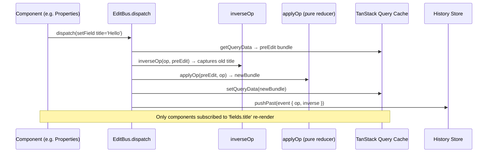
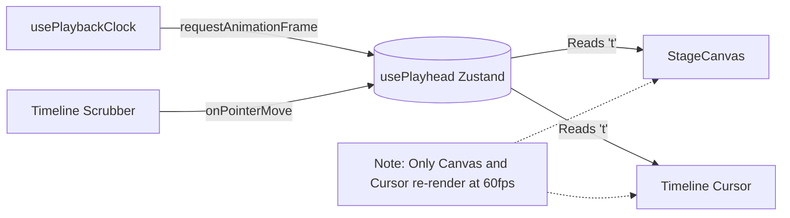
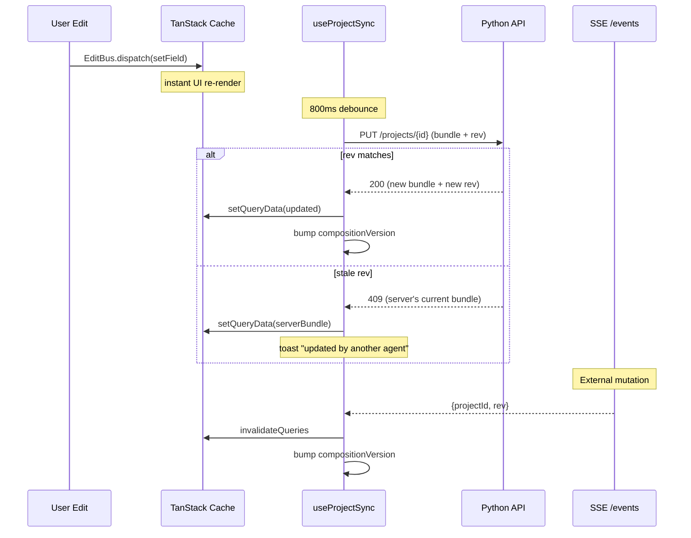

# State Management

The `ovk-web` application avoids massive global React context trees. Instead, it utilizes three distinct, highly optimized state management strategies depending on the domain.

## 1. The EditBus (Project Mutations)

**Problem**: If the entire project tree is stored in a single React `useState` or `useReducer`, any small edit (like typing a letter in a title) causes the entire Timeline, Canvas, and AI Dock to re-render, destroying performance.

**Solution**: The `EditBus` + TanStack Query cache mutation.

- **Operations**: The UI only emits strict commands (`addSlide`, `removeSlide`, `duplicateSlide`, `restoreSlide`, `reorderSlides`, `setField`, `setSlideHtml`, `setTransition`, `setAsset`, `setVoiceover`, `setDuration`, `setCaptionStyle`).
- **Undo/Redo**: The inverse is captured **at dispatch time** from the *pre-edit* state (`inverseOp(op, current)` runs *before* `applyOp`), and stored on `EditEvent.inverse`. The history stack (`useHistory` Zustand) holds these events.
  - `undo()` pops the event and replays `event.inverse` (with `skipHistory`). It does **not** recompute the inverse — recomputing against the post-edit cache would read back the new value and be a no-op for value ops like `setField`.
  - `redo()` pops the future stack and replays the original `event.op`.
  - **Exhaustiveness**: `applyOp` and `inverseOp` each end with a `const _exhaustive: never = op` guard. Adding a new `EditOp` variant without a case is a compile error, so undo can never silently break.
- **UI**: Undo/Redo live in the `AppShell` overflow menu (⌘Z / ⌘⇧Z / Ctrl-Y), shown only on project routes, disabled when the stacks are empty.

## 2. The Playhead (60fps Volatile State)

**Problem**: Video scrubbing and playback run at 60fps. If the playhead time (`t`) is stored in TanStack Query or React Context, scrubbing the timeline would cause the entire application UI to re-render 60 times a second.

**Solution**: A dedicated Zustand store (`usePlayhead`).

- `usePlayhead` stores highly volatile data: `t` (current time), `playing` (boolean), and `duration` (total project length).
- Components that don't care about the exact millisecond (like the Properties panel or the HTML Editor) do not subscribe to this store, shielding them from render churn.

## 3. Server Sync (useProjectSync)

**Problem**: Edits happen locally (instant UI feedback), but the preview is
served by the Python SSR server. The server must receive edits to re-stamp the
composition, and external mutations (AI agent, another client) must push back.

**Solution**: `useProjectSync(projectId)` — a single hook mounted in `Studio.tsx`
with two channels:

- **Debounced autosave**: 800ms after the last local edit, PUTs the full bundle
  with `rev`. A `lastSerialized` ref prevents re-saving data that came from the
  server (which would loop).
- **409 conflict**: The response body carries the server's current bundle. The
  client replaces its cache — the other agent won.
- **SSE push**: `EventSource` on `/api/projects/{id}/events`. On push: invalidate
  the query (refetch) + bump `compositionVersion`.
- **compositionVersion** (`useCompositionVersion` Zustand): incremented after every
  successful PUT or SSE push. StageCanvas appends `?v=N` to the HF player `src` →
  the iframe reloads with the re-stamped composition.

See [`concurrency.md`](./concurrency.md) for the rev-hash design.

## 4. Derived State

**Problem**: Determining which slide is currently visible on the canvas requires
calculating the cumulative sum of all previous slide durations. Doing this on
every render is expensive and error-prone.

**Solution**: Memoized selector hooks.
- **`useActiveSlide`**: Subscribes to the `usePlayhead` and the `ProjectBundle`,
  calculates the cumulative starts, and returns the ID and metadata of the
  currently visible slide.
- If the playhead scrubs within the bounds of a single slide, `useActiveSlide`
  does not trigger a re-render because the returned slide ID hasn't changed.
